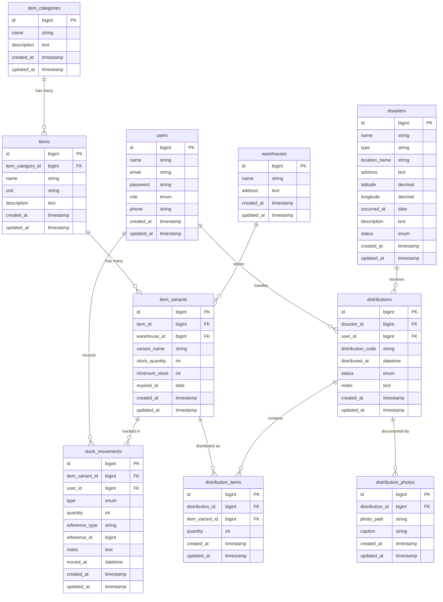

# Entity Relationship Diagram - SIMBANSOS

Berikut adalah diagram relasi entitas (ERD) yang lebih mendetail berdasarkan migration yang telah dibuat, lengkap dengan tipe data dan struktur relasinya.

## Penjelasan Relasi
1. **users** mencatat banyak **stock_movements** (Admin yang melakukan input stok).
2. **users** menangani banyak **distributions** (Petugas Lapangan yang mendistribusikan barang).
3. **item_categories** memiliki banyak **items** (Setiap barang masuk ke dalam satu kategori, misal: Makanan -> Indomie).
4. **items** memiliki banyak **item_variants** (Setiap barang bisa memiliki banyak varian, misal: Indomie Goreng, Indomie Kuah).
5. **warehouses** menyimpan banyak **item_variants** (Setiap varian barang disimpan di sebuah gudang).
6. **item_variants** dicatat dalam banyak **stock_movements** (Mutasi stok masuk atau keluar dari sebuah varian barang).
7. **item_variants** didistribusikan dalam bentuk banyak **distribution_items** (Varian barang mana saja yang didistribusikan).
8. **disasters** menerima banyak **distributions** (Sebuah lokasi bencana bisa mendapatkan beberapa kali distribusi bantuan).
9. **distributions** berisi banyak **distribution_items** (Dalam sekali distribusi, bisa memuat banyak varian barang).
10. **distributions** didokumentasikan oleh banyak **distribution_photos** (Satu kali distribusi bisa memiliki banyak foto bukti lapangan).
