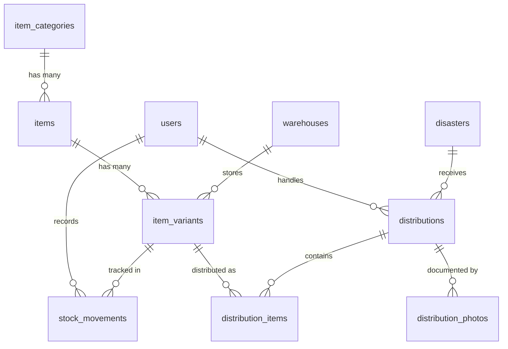

# Konteks Migration Database — SIMBANSOS

> Dokumen ini menjadi acuan untuk membuat file migration Laravel.
> Semua nama tabel dan kolom menggunakan **bahasa Inggris**, mengikuti konvensi Laravel:
> - Nama tabel: **plural**, **snake_case** (contoh: `item_categories`)
> - Foreign key: **singular_snake_case** + `_id` (contoh: `item_id`)
> - Timestamps: `created_at`, `updated_at` otomatis via `$table->timestamps()`
> - Soft delete: `deleted_at` via `$table->softDeletes()` jika diperlukan

---

## ERD (Entity Relationship Diagram)

---

## Tabel 1 — `users`

> Tabel bawaan Laravel (sudah ada via `php artisan make:auth` / Breeze / Jetstream).
> Ditambahkan kolom `role` untuk membedakan hak akses.

| Kolom | Tipe | Keterangan |
|-------|------|------------|
| `id` | `id()` | Primary key |
| `name` | `string` | Nama lengkap pengguna |
| `email` | `string, unique` | Email login |
| `password` | `string` | Password (hashed) |
| `role` | `enum('admin', 'field_officer')` | Peran pengguna: **admin** (Administrator) atau **field_officer** (Petugas Lapangan) |
| `phone` | `string, nullable` | Nomor telepon |
| `timestamps` | | `created_at`, `updated_at` |

**Catatan:** Publik/masyarakat **tidak memiliki akun** — mengakses portal tanpa login.

---

## Tabel 2 — `item_categories`

> Kategori barang bantuan (makanan, pakaian, tenda, obat-obatan, dll).

| Kolom | Tipe | Keterangan |
|-------|------|------------|
| `id` | `id()` | Primary key |
| `name` | `string` | Nama kategori (contoh: "Food", "Clothing", "Medicine") |
| `description` | `text, nullable` | Deskripsi kategori |
| `timestamps` | | `created_at`, `updated_at` |

---

## Tabel 3 — `items`

> Master data barang bantuan sosial.

| Kolom | Tipe | Keterangan |
|-------|------|------------|
| `id` | `id()` | Primary key |
| `item_category_id` | `foreignId, constrained` | FK → `item_categories.id` |
| `name` | `string` | Nama barang (contoh: "Mie Instan", "Selimut") |
| `unit` | `string` | Satuan barang (contoh: "pcs", "box", "kg", "pack") |
| `description` | `text, nullable` | Deskripsi barang |
| `timestamps` | | `created_at`, `updated_at` |

---

## Tabel 4 — `warehouses`

> Lokasi gudang penyimpanan barang bantuan.

| Kolom | Tipe | Keterangan |
|-------|------|------------|
| `id` | `id()` | Primary key |
| `name` | `string` | Nama gudang (contoh: "Gudang Utama Semarang") |
| `address` | `text, nullable` | Alamat lengkap gudang |
| `timestamps` | | `created_at`, `updated_at` |

---

## Tabel 5 — `item_variants`

> Varian spesifik dari setiap barang beserta stok per gudang.
> Contoh: Selimut → varian "Ukuran Dewasa", "Ukuran Anak".

| Kolom | Tipe | Keterangan |
|-------|------|------------|
| `id` | `id()` | Primary key |
| `item_id` | `foreignId, constrained` | FK → `items.id` |
| `warehouse_id` | `foreignId, constrained` | FK → `warehouses.id` |
| `variant_name` | `string` | Nama varian (contoh: "Ukuran Dewasa", "Rasa Ayam") |
| `stock_quantity` | `unsignedInteger, default(0)` | Jumlah stok saat ini |
| `minimum_stock` | `unsignedInteger, default(0)` | Batas minimum stok untuk trigger peringatan |
| `expired_at` | `date, nullable` | Tanggal kedaluwarsa (jika ada, untuk metode FEFO) |
| `timestamps` | | `created_at`, `updated_at` |

**Aturan bisnis:**
- `stock_quantity` **tidak boleh < 0** → validasi di Model / Observer.
- Barang dengan `expired_at` terdekat dikeluarkan lebih dulu (FEFO).

---

## Tabel 6 — `stock_movements`

> Log riwayat perubahan stok (masuk/keluar) untuk audit trail.

| Kolom | Tipe | Keterangan |
|-------|------|------------|
| `id` | `id()` | Primary key |
| `item_variant_id` | `foreignId, constrained` | FK → `item_variants.id` |
| `user_id` | `foreignId, constrained` | FK → `users.id` — siapa yang melakukan perubahan |
| `type` | `enum('in', 'out')` | Jenis pergerakan: **in** (barang masuk) atau **out** (barang keluar/distribusi) |
| `quantity` | `integer` | Jumlah barang yang masuk atau keluar |
| `reference_type` | `string, nullable` | Polymorphic: tipe model referensi (contoh: `Distribution`) |
| `reference_id` | `unsignedBigInteger, nullable` | Polymorphic: ID model referensi |
| `notes` | `text, nullable` | Catatan tambahan |
| `moved_at` | `datetime` | Tanggal & waktu pergerakan stok |
| `timestamps` | | `created_at`, `updated_at` |

**Catatan:** Kolom `reference_type` + `reference_id` menggunakan pola **polymorphic relation** agar stock movement bisa dikaitkan ke distribusi maupun penerimaan barang.

---

## Tabel 7 — `disasters`

> Data lokasi bencana yang menjadi tujuan distribusi.

| Kolom | Tipe | Keterangan |
|-------|------|------------|
| `id` | `id()` | Primary key |
| `name` | `string` | Nama/judul kejadian bencana (contoh: "Banjir Demak 2026") |
| `type` | `string` | Jenis bencana (contoh: "Banjir", "Gempa", "Longsor", "Kebakaran") |
| `location_name` | `string` | Nama lokasi (kecamatan/desa/kelurahan) |
| `address` | `text, nullable` | Alamat detail lokasi bencana |
| `latitude` | `decimal(10,7), nullable` | Koordinat lintang |
| `longitude` | `decimal(10,7), nullable` | Koordinat bujur |
| `occurred_at` | `date` | Tanggal terjadinya bencana |
| `description` | `text, nullable` | Deskripsi situasi bencana |
| `status` | `enum('active', 'resolved')` | Status bencana: **active** (masih berlangsung) atau **resolved** (selesai ditangani) |
| `timestamps` | | `created_at`, `updated_at` |

---

## Tabel 8 — `distributions`

> Transaksi distribusi/penyaluran bantuan ke lokasi bencana.

| Kolom | Tipe | Keterangan |
|-------|------|------------|
| `id` | `id()` | Primary key |
| `disaster_id` | `foreignId, constrained` | FK → `disasters.id` — tujuan distribusi |
| `user_id` | `foreignId, constrained` | FK → `users.id` — petugas lapangan yang bertugas |
| `distribution_code` | `string, unique` | Kode unik distribusi (auto-generated, contoh: "DIST-20260727-001") |
| `distributed_at` | `datetime` | Tanggal dan waktu distribusi dilakukan |
| `status` | `enum('pending', 'on_progress', 'delivered')` | Status distribusi |
| `notes` | `text, nullable` | Catatan tambahan |
| `timestamps` | | `created_at`, `updated_at` |

**Aturan bisnis:**
- Status `delivered` **hanya bisa diset** jika sudah ada minimal 1 foto bukti di `distribution_photos`.
- Perubahan status mengikuti alur: `pending` → `on_progress` → `delivered`.

---

## Tabel 9 — `distribution_items`

> Detail barang yang didistribusikan dalam setiap transaksi distribusi.

| Kolom | Tipe | Keterangan |
|-------|------|------------|
| `id` | `id()` | Primary key |
| `distribution_id` | `foreignId, constrained` | FK → `distributions.id` |
| `item_variant_id` | `foreignId, constrained` | FK → `item_variants.id` — varian barang yang dikeluarkan |
| `quantity` | `unsignedInteger` | Jumlah barang yang didistribusikan |
| `timestamps` | | `created_at`, `updated_at` |

**Aturan bisnis:**
- `quantity` **tidak boleh melebihi** `stock_quantity` pada `item_variants`.
- Saat record ini dibuat, `stock_quantity` di `item_variants` harus dikurangi dan `stock_movements` dicatat otomatis (via Observer/Event).

---

## Tabel 10 — `distribution_photos`

> Foto bukti dokumentasi penyaluran bantuan di lapangan.

| Kolom | Tipe | Keterangan |
|-------|------|------------|
| `id` | `id()` | Primary key |
| `distribution_id` | `foreignId, constrained` | FK → `distributions.id` |
| `photo_path` | `string` | Path file foto (disimpan via Laravel Storage) |
| `caption` | `string, nullable` | Keterangan singkat foto |
| `timestamps` | | `created_at`, `updated_at` |

**Aturan bisnis:**
- Minimal **1 foto** wajib diunggah sebelum status distribusi bisa diubah ke `delivered`.

---

## Urutan Pembuatan Migration

> Urutan ini memperhitungkan dependensi foreign key.

| No | Migration File | Tabel |
|----|----------------|-------|
| 1 | `xxxx_xx_xx_000001_add_role_to_users_table.php` | Modifikasi `users` — tambah kolom `role` dan `phone` |
| 2 | `xxxx_xx_xx_000002_create_item_categories_table.php` | `item_categories` |
| 3 | `xxxx_xx_xx_000003_create_items_table.php` | `items` |
| 4 | `xxxx_xx_xx_000004_create_warehouses_table.php` | `warehouses` |
| 5 | `xxxx_xx_xx_000005_create_item_variants_table.php` | `item_variants` |
| 6 | `xxxx_xx_xx_000006_create_stock_movements_table.php` | `stock_movements` |
| 7 | `xxxx_xx_xx_000007_create_disasters_table.php` | `disasters` |
| 8 | `xxxx_xx_xx_000008_create_distributions_table.php` | `distributions` |
| 9 | `xxxx_xx_xx_000009_create_distribution_items_table.php` | `distribution_items` |
| 10 | `xxxx_xx_xx_000010_create_distribution_photos_table.php` | `distribution_photos` |

---

## Ringkasan Relasi Antar Tabel

| Relasi | Tipe | Penjelasan |
|--------|------|------------|
| `item_categories` → `items` | One to Many | Satu kategori punya banyak barang |
| `items` → `item_variants` | One to Many | Satu barang punya banyak varian |
| `warehouses` → `item_variants` | One to Many | Satu gudang menyimpan banyak varian barang |
| `item_variants` → `stock_movements` | One to Many | Satu varian punya banyak log pergerakan stok |
| `users` → `stock_movements` | One to Many | Satu user bisa mencatat banyak pergerakan stok |
| `disasters` → `distributions` | One to Many | Satu lokasi bencana bisa menerima banyak distribusi |
| `users` → `distributions` | One to Many | Satu petugas bisa menangani banyak distribusi |
| `distributions` → `distribution_items` | One to Many | Satu distribusi berisi banyak item barang |
| `distributions` → `distribution_photos` | One to Many | Satu distribusi punya banyak foto bukti |
| `item_variants` → `distribution_items` | One to Many | Satu varian bisa muncul di banyak distribusi |

---

> **Catatan untuk AI Coding Assistant:**
> - Gunakan `$table->id()` sebagai primary key.
> - Gunakan `$table->foreignId('...')->constrained()->cascadeOnDelete()` untuk foreign key.
> - Tambahkan `$table->timestamps()` di setiap tabel.
> - Untuk kolom `enum`, gunakan `$table->enum('kolom', ['val1', 'val2'])`.
> - Untuk koordinat gunakan `$table->decimal('latitude', 10, 7)`.
> - File foto disimpan menggunakan **Laravel Storage** (`storage/app/public/...`), kolom `photo_path` hanya menyimpan path relatif.
> - Semua business rule validasi stok (tidak boleh negatif, FEFO) diimplementasikan di **Model Observer** atau **Filament Resource hooks**.
